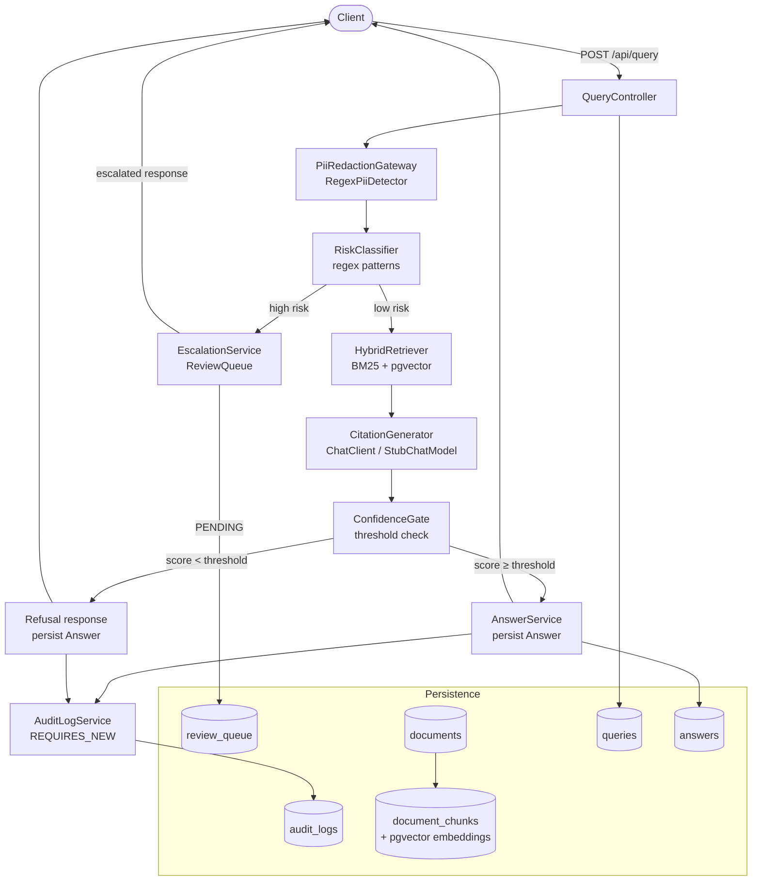
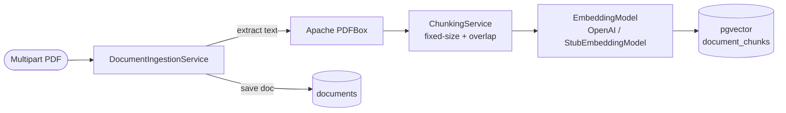

# Architecture

Python / FastAPI rewrite of PolicyGuard. Controllers map to FastAPI routes under `policyguard.api.routes`;
Spring `ChatClient` / `StubChatModel` are replaced by OpenAI-compatible and stub providers in `policyguard.providers`.

## Request Flow



## Component Descriptions

| Component | Class | Responsibility |
|---|---|---|
| `QueryController` | `com.policyguard.controller.QueryController` | Accepts query, orchestrates pipeline |
| `PiiRedactionGateway` | `policyguard.services.pii.PiiRedactionGateway` | In-process regex PII detect + placeholder redaction |
| `RiskClassifier` | `com.policyguard.service.risk.RiskClassifier` | Regex-based routing: answered vs escalated |
| `HybridRetriever` | `com.policyguard.service.retrieval.HybridRetriever` | Combines BM25 (full-text) + cosine similarity (pgvector) |
| `CitationGenerator` | `com.policyguard.service.citation.CitationGenerator` | Calls ChatClient with retrieved chunks; formats citations |
| `ConfidenceGate` | `com.policyguard.service.confidence.ConfidenceGate` | Compares max chunk score against configured threshold |
| `EscalationService` | `com.policyguard.service.escalation.EscalationService` | Persists `review_queue` row; returns escalated response |
| `AuditLogService` | `com.policyguard.service.audit.AuditLogService` | Appends immutable audit events (REQUIRES_NEW) |
| `ReviewController` | `com.policyguard.controller.ReviewController` | Lists queue; resolves with APPROVED/REJECTED decision |

## Ingestion Flow



## Profile Matrix

| Profile | Chat | Embeddings | PII |
|---|---|---|---|
| `stub` | `StubChatProvider` | `StubEmbeddingProvider` | `RegexPiiDetector` (in-process) |
| `lmstudio` / `openrouter` | OpenAI-compatible chat | OpenAI-compatible embeddings | `RegexPiiDetector` (in-process) |
| `POLICYGUARD_PII_STUB=true` | (unchanged) | (unchanged) | `StubPiiDetector` (no-op) |

## Stub Embedding Similarity

`StubEmbeddingModel` hashes text via SHA-256 → L2-normalised `float[1536]` with all-positive values.
Expected cosine similarity between any two stub embeddings ≈ **0.75**.

- Default threshold (`policyguard.confidence.threshold`) = **0.65** → stub scores **pass** the gate
- IT "refused" tests override threshold to **0.99** → stub scores **fail** the gate

## Database Schema (simplified)

```
documents          (id, document_id, title, doc_type, …)
document_chunks    (id, document_id FK, paragraph_ref, content, embedding vector(1536))
queries            (id, query_id, user_id, question, redacted_question, risk_level, …)
answers            (id, query_id FK, answer_text, citations jsonb, confidence_score, outcome, …)
review_queue       (id, query_id FK, reviewer_id, decision, status, …)
audit_logs         (id, query_id FK, event_type, actor, payload jsonb, occurred_at, …)
```
