# PolicyGuard — Interview Prep

Detailed data flows, pipelines, and talking points grounded in the current Python/FastAPI codebase.

---

## 1. One-minute pitch

**PolicyGuard** is a compliance RAG service that answers regulatory / policy questions with **cited evidence**, while:

1. **Redacting PII** before text hits embeddings or an LLM  
2. **Escalating high-risk** questions to a human review queue  
3. **Refusing** answers when retrieval confidence or citation verification fails  
4. Writing an **immutable audit trail** of every pipeline step  

Stack: **FastAPI + SQLAlchemy + Postgres/pgvector + Redis + in-process regex PII redaction + OpenAI-compatible chat/embeddings** (or deterministic stubs).

---

## 2. System map (components & data stores)

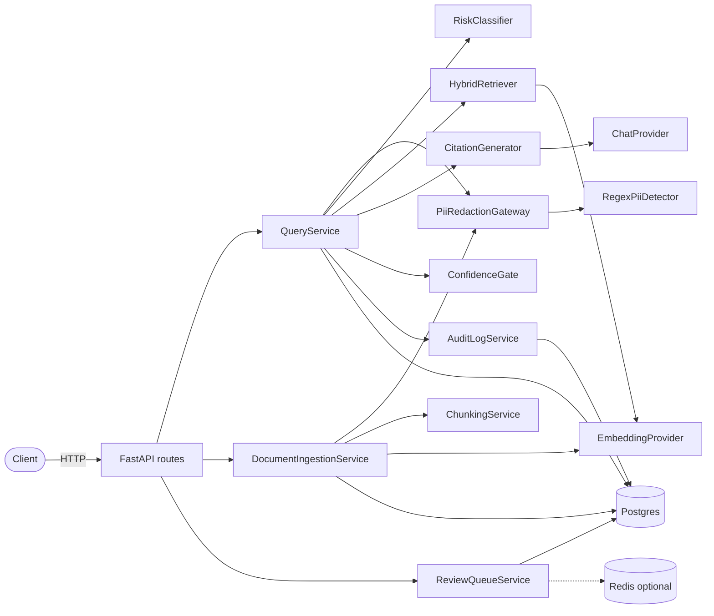

| Layer | Responsibility |
|---|---|
| **API** | Thin HTTP: parse request, call service, map outcome → status/body |
| **QueryService** | Orchestrates the query pipeline end-to-end |
| **DocumentIngestionService** | PDF/text → redact → chunk → embed → store |
| **Providers** | Pluggable chat + embeddings (`stub` / LM Studio / OpenRouter) |
| **Postgres + pgvector** | Source of truth for docs, chunks, queries, answers, review, audit |
| **Redis** | Optional side-channel list of pending review item IDs |
| **PII (RegexPiiDetector)** | In-process structured PII detection; no sidecar container |

---

## 3. End-to-end data flow (big picture)

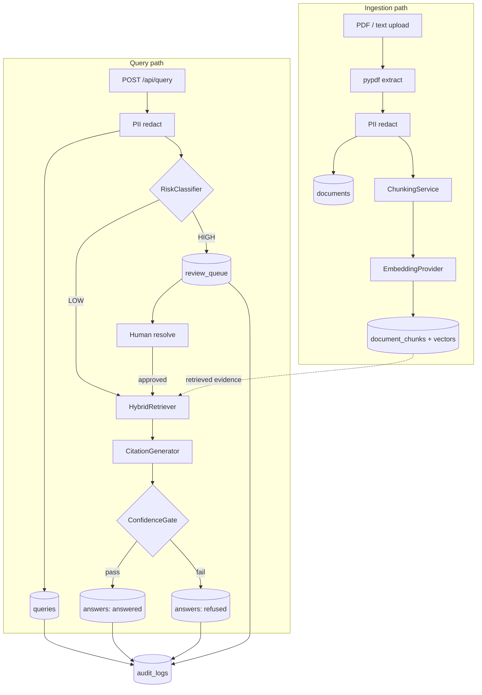

**Mental model for interviews:**  
Ingest builds a **redacted, searchable policy corpus**. Query never sends raw PII to the LLM; it either **answers with citations**, **refuses**, or **escalates**.

---

## 4. Ingestion pipeline (write path)

**Entry:** `POST /api/documents` (multipart PDF + optional JSON `metadata`)  
**Orchestrator:** `DocumentIngestionService`

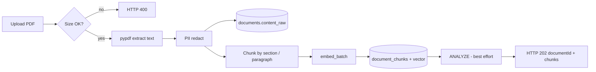

### Step-by-step data transformation

| Step | Code | Input | Output / side effect |
|---|---|---|---|
| 1. Read upload | `routes.documents_endpoint` | multipart bytes | `pdf_bytes`, filename, metadata |
| 2. Size check | `ingest_bytes` | bytes | reject if > `ingestion_max_file_bytes` (~25MB) |
| 3. PDF extract | `_extract_pdf` (pypdf) | PDF bytes | plain text (`\n\n` between pages) |
| 4. PII redaction | `PiiRedactionGateway.redact` | raw text | redacted text + entity list |
| 5. Persist document | `Document` row | redacted full text | `documents` — **stores redacted text as `content_raw`** |
| 6. Chunk | `ChunkingService.chunk` | redacted text | list of `{text, paragraph_ref}` |
| 7. Embed | `EmbeddingProvider.embed_batch` | chunk texts | vectors (dim = `embedding_dim`, default 1536) |
| 8. Persist chunks | `DocumentChunk` rows | text + embedding | `document_chunks` |
| 9. Analyze (best-effort) | `ANALYZE document_chunks` | — | helps Postgres planner |

### Chunking rules (interview detail)

- Split on blank lines (`\n{2,}`) into paragraphs  
- Detect section headings: `Section 1.2` or short numeric headings like `3.1 Title`  
- Build refs: `Section 3.1`, `Section 3.1, Paragraph 2`, or `Paragraph N`  
- If a paragraph > `chunking_max_chars` (1200), sliding window with `chunking_overlap` (150)

### What never leaves ingestion

- Raw PII from the PDF is **not** stored in `documents` / `document_chunks` when the regex detector finds it (placeholders like `<EMAIL>`, `<SSN>`).  
- With `POLICYGUARD_PII_STUB=true`, redaction is a no-op (isolated tests).

### Ingest response (HTTP 202)

```json
{
  "documentId": "DOC-...",
  "chunksCreated": 12,
  "piiEntitiesRedacted": 3,
  "title": "Retention Policy.pdf"
}
```

---

## 5. Query pipeline (read / answer path)

**Entry:** `POST /api/query`  
**Body:** `{ "question": "...", "userId": "...", "filters": { optional } }`  
**Orchestrator:** `QueryService.handle`

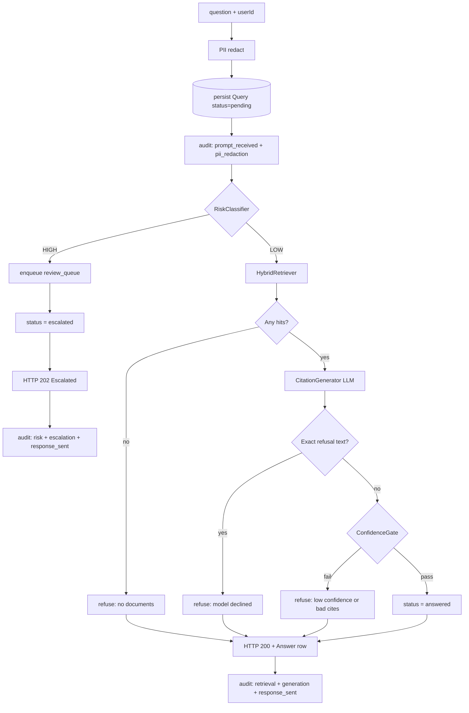

### Stage A — PII redaction

1. `RegexPiiDetector.analyze(text)` runs **in-process** (no Docker/HTTP analyzer)  
2. Detects structured PII via regex (+ Luhn check for credit cards):

| Entity type | How detected | Placeholder |
|---|---|---|
| EMAIL_ADDRESS | email regex | `<EMAIL>` |
| PHONE_NUMBER | US-style phone regex | `<PHONE>` |
| US_SSN | `###-##-####` | `<SSN>` |
| CREDIT_CARD | digit groups + Luhn | `<CREDIT_CARD>` |
| IP_ADDRESS | IPv4 regex | `<IP>` |
| US_BANK_NUMBER | "routing/account" + digits | `<BANK_ACCOUNT>` |
| PERSON | Mr/Mrs/Ms/Dr/Prof + name | `<PERSON>` |
| other | — | `<ENTITY_TYPE>` |

3. Overlapping spans are deduped (prefer longer match); then replaced **right-to-left** with placeholders.  
4. Persist `queries` row:
   - `original_prompt` = **redacted** text (name is historical; raw question is not stored)
   - `redacted` = bool
   - `redaction_log` = `{ "entities": [...] }`
   - `status` = `pending`

**Interview talking point:** PII is stripped **before** risk classification, retrieval embeddings, and LLM prompt construction — with zero extra infra beyond the app process. Trade-off: weaker on free-form names vs NER models (spaCy/GLiNER); strong on structured identifiers.

### Stage B — Risk classification (early exit)

`RiskClassifier` runs **regex patterns** (configurable via settings) on the **redacted** prompt. First match wins → `HIGH` + category + `requires_review=True`.

Default categories:

| Category | Intent (pattern theme) |
|---|---|
| `regulatory_interpretation` | FINRA/SEC/GDPR/… + interpret/apply |
| `customer_data_exposure` | customer/client data/PII + access/share/disclose |
| `policy_exception` | exception/waiver/bypass + policy/control |
| `financial_advice` | advise/recommend + invest/allocate/withdraw |

**If HIGH:**

1. `ReviewQueueService.enqueue` → `review_queue` row (`status=pending`)  
2. Optional Redis `RPUSH review:queue item_id`  
3. Query `status = escalated`  
4. Audit: `risk_classification`, `escalation`, `response_sent`  
5. Return **HTTP 202** Escalated — **no retrieval, no LLM**

### Stage C — Hybrid retrieval

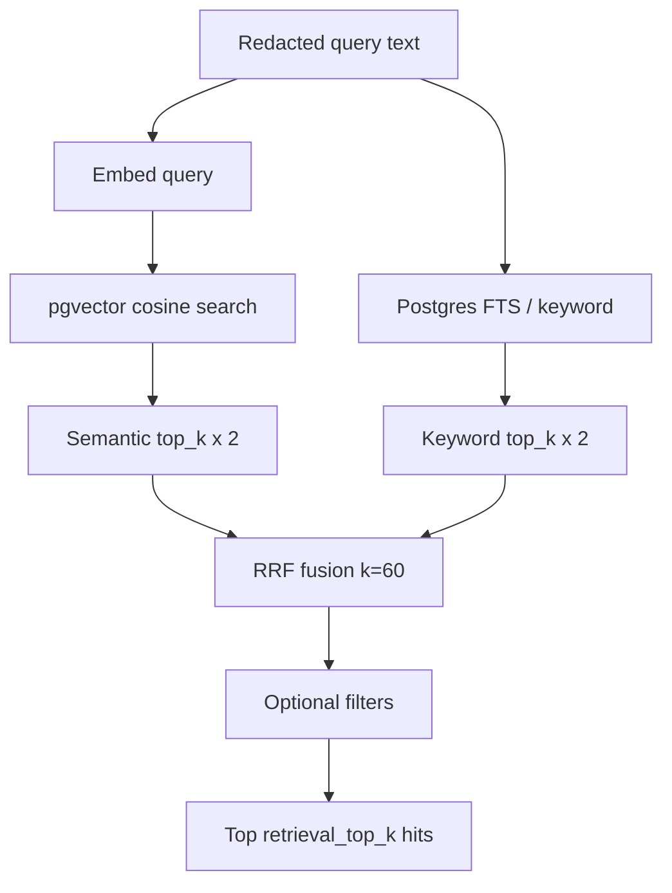

`HybridRetriever.retrieve(redacted_text, filters, top_k)`:

1. **Embed query** with same embedding provider used at ingest  
2. **Semantic search** (pgvector cosine distance `<=>`):
   - score = `1 - (embedding <=> query_vec)`  
   - fetch `top_k * 2` candidates  
3. **Keyword / FTS** (Postgres):
   - `to_tsvector('english', text) @@ plainto_tsquery(...)`  
   - rank with `ts_rank_cd`  
   - fetch `top_k * 2`  
4. **RRF fusion** (`RrfFusionService`):
   - score = `Σ 1/(k + rank)` across lists (`retrieval_rrf_k` default 60)  
5. Prefer semantic similarity as the final `hit.score` when the chunk was in the semantic list; keyword-only hits get an RRF-derived score  
6. Optional **filters** (e.g. `documentId`, or chunk metadata keys)  
7. Return top `retrieval_top_k` (default 5)

**Interview talking point:** Hybrid = lexical precision (policy jargon, section numbers) + semantic recall (paraphrased questions), fused with RRF so neither list dominates by raw score scale.

### Stage D — Citation generation (LLM)

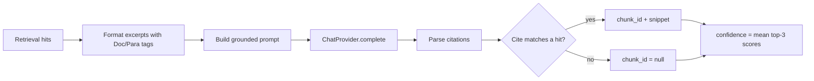

`CitationGenerator.generate(query, hits)`:

1. Format excerpts as `[Doc: {document_id}, Para: {paragraph_ref}] {text}`  
2. Prompt instructs: answer **only** from excerpts; cite every claim; if insufficient, reply **exactly**:
   > `I cannot answer this based on the available policy documents.`  
3. Chat provider returns text (`temperature=0` for OpenAI-compatible)  
4. Parse citations with regex `[Doc: …, Para: …]`  
5. Verify each cite against retrieved hits:
   - match → attach `chunk_id` + snippet (first 200 chars)  
   - no match → `chunk_id = None` (unverified)  
6. **Confidence** = mean of top-3 hit scores, clamped to `[0, 1]`

### Stage E — Confidence gate

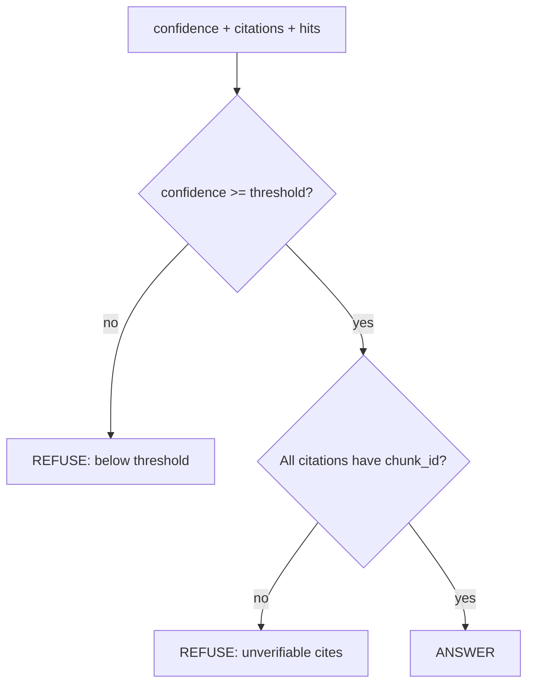

`ConfidenceGate.evaluate(confidence, citations, hits)`:

| Check | Fail → refuse reason |
|---|---|
| `confidence < confidence_threshold` (default 0.65) | Retrieval confidence below threshold |
| Any citation has `chunk_id is None` | Citations could not be verified against retrieved chunks |

Also: if model text **exactly** equals the explicit refusal string → refuse without treating it as an answered citation path.

### Stage F — Persist outcome

| Outcome | Query.status | Answer row | HTTP |
|---|---|---|---|
| Answered | `answered` | text + citations + confidence + retrieval_hits | 200 |
| Refused | `refused` | refusal message (citations often empty) | 200 |
| Escalated | `escalated` | no answer yet | 202 |

`answers.retrieval_hits` stores the evidence used (chunk ids, scores, snippets) for later audit/debug.

---

## 6. Review / human-in-the-loop flow

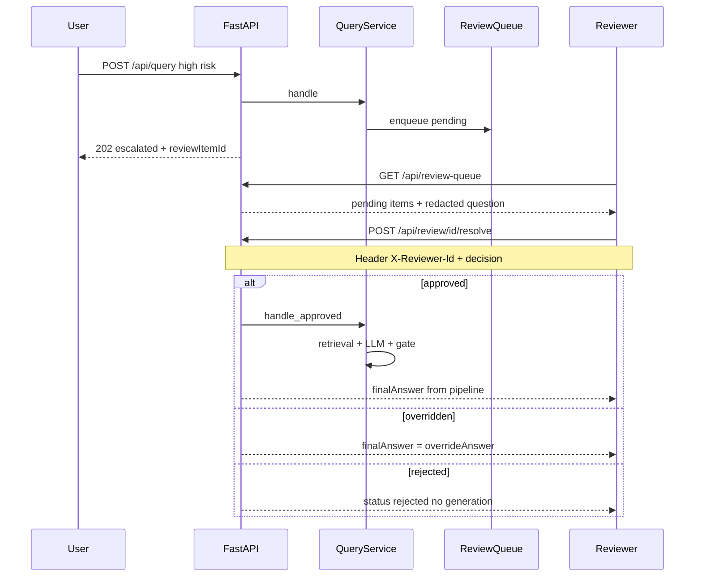

**Auth notes:**

- Header `X-Reviewer-Id` must match body `reviewerId`  
- If `POLICYGUARD_REVIEWERS_ALLOWED_IDS` is non-empty, ID must be in that list  
- Empty allow-list = **dev mode** (logged warning at startup)

**Decisions:** `approved` | `rejected` | `overridden`  
- `overridden` requires `overrideAnswer`  
- Redis: on enqueue `RPUSH`, on resolve `LREM` (best-effort; Postgres remains source of truth)

---

## 7. Audit trail (what events exist)

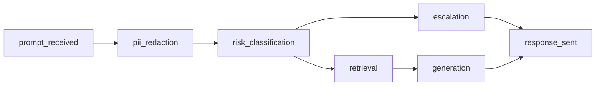

Every query appends chronological `audit_logs` rows. Typical sequence:

| Order | event_type | Meaning |
|---|---|---|
| 1 | `prompt_received` | Length of raw prompt; stores redacted prompt in output (not raw PII) |
| 2 | `pii_redaction` | Entities found + count |
| 3 | `risk_classification` | risk_level + category |
| 4a | `escalation` | review_item_id (high risk branch) |
| 4b | `retrieval` | hits count + top_score (answer path) |
| 5 | `generation` | confidence, citation_count, or skipped |
| 6 | `response_sent` | final status: answered / refused / escalated |

Fetch with `GET /api/audit/{queryId}`.

**Interview talking point:** Audit is append-only application events (not a cryptographic ledger). Good enough to demonstrate compliance observability; you can discuss upgrading to WORM storage / separate DB user with INSERT-only grants.

---

## 8. Database schema & what each table holds

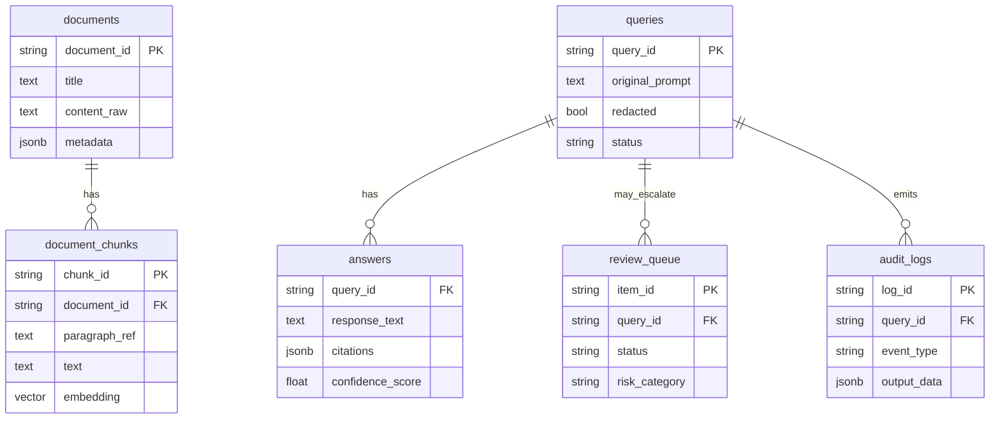

| Table | Key fields | Role in data flow |
|---|---|---|
| `documents` | document_id, title, doc_type, content_raw, metadata | Full redacted document body |
| `document_chunks` | chunk_id, paragraph_ref, text, embedding vector(1536) | Retrieval units; GIN FTS + IVFFlat vector index |
| `queries` | query_id, original_prompt (redacted), redaction_log, status | One row per user question |
| `answers` | response_text, citations JSONB, confidence_score, retrieval_hits JSONB | Generated answer or refusal payload |
| `review_queue` | item_id, escalation_reason, risk_category, status, override_answer | Human workflow state machine |
| `audit_logs` | event_type, actor, input_data, output_data, timestamp | Pipeline chronology |

Indexes worth mentioning: GIN on `to_tsvector(text)`, IVFFlat on `embedding vector_cosine_ops`, `review_queue(status)`, `audit_logs(query_id)`.

---

## 9. Concrete walkthrough (example)

**User question:**  
`How long must customer PII be retained after account closure? Contact jane@acme.com`

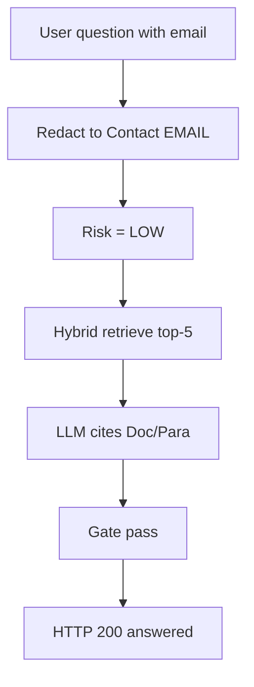

### Ingest (already done)

Policy PDF → redacted → chunks like `Section 4.2, Paragraph 1` with embeddings in Postgres.

### Query path

1. **PII:** email → `… Contact <EMAIL>`  
2. **Persist query** with redacted prompt  
3. **Risk:** does not match HIGH patterns → LOW  
4. **Retrieve:** FTS hits “retained” / “PII”; vector hits semantic neighbors → RRF top-5  
5. **LLM:** answers from excerpts with `[Doc: DOC-PII-01, Para: Section 4.2]`  
6. **Gate:** mean top-3 scores ≥ 0.65 and cites verify → **answered**  
7. **Audit:** full event chain; client gets 200 + answer + citations  

### Alternate: high-risk question

`Can we share customer SSN data with a partner?`  
→ risk `customer_data_exposure` → **escalated** (202) → no LLM until reviewer **approves**, then `handle_approved` runs the same retrieval/generation/gate path.

### Alternate: weak evidence

Retrieval scores below threshold or LLM invents a Doc/Para not in hits → **refused** with safe message.

---

## 10. Provider profiles (how external calls change)

| `POLICYGUARD_PROFILE` | Chat | Embeddings | PII |
|---|---|---|---|
| `stub` | Deterministic: echo first excerpt + cite, or fixed refusal | SHA-256 → L2 vector (dim N) | In-process regex |
| `lmstudio` | Local OpenAI-compatible | Local | In-process regex |
| `openrouter` | OpenRouter API | Local unless overridden | In-process regex |

Optional: `POLICYGUARD_PII_STUB=true` disables redaction for isolated tests.

**Stub embedding nuance:** cosine similarity between any two stub vectors ≈ **0.75**, so default threshold **0.65** usually **passes**; tests can raise threshold to force refusal.

---

## 11. API cheat sheet

| Method | Path | Success | Data in → data out |
|---|---|---|---|
| POST | `/api/query` | 200 / 202 | question → answered \| refused \| escalated |
| POST | `/api/documents` | 202 | PDF → documentId, chunksCreated, pii count |
| GET | `/api/review-queue` | 200 | pending review items |
| POST | `/api/review/{itemId}/resolve` | 200 | decision → status + optional finalAnswer |
| GET | `/api/audit/{queryId}` | 200 | ordered events |
| GET | `/health` | 200 | liveness |

---

## 12. Design decisions — interview talking points

Use these as “why did you build it this way?” answers.

1. **PII before everything else**  
   Same gateway on ingest and query so embeddings, stored text, risk regex, and LLM prompts never see raw PII. Detector is in-process regex — no external sidecar.

2. **Risk gate before retrieval/LLM**  
   Saves cost and avoids generating answers for questions that must be human-reviewed (exceptions, data sharing, regulatory interpretation).

3. **Hybrid retrieval + RRF**  
   Policy docs need exact terms *and* semantic paraphrase. RRF avoids brittle score calibration between FTS ranks and cosine similarity.

4. **Citations must resolve to retrieved chunks**  
   Prevents hallucinated document IDs from being returned as verified evidence even if the model “sounds” confident.

5. **Confidence from retrieval, not LLM self-score**  
   Mean of top-3 hit scores is deterministic and testable; pairs well with a threshold gate.

6. **Redacted prompt stored as `original_prompt`**  
   Privacy-preserving persistence; raw user text length is audited, not the raw string.

7. **Stub profile**  
   Full pipeline tests/evals without GPU or API keys — critical for CI and demos. PII still runs in-process unless explicitly stubbed.

8. **Postgres as system of record; Redis optional**  
   Review queue works if Redis is down; Redis only accelerates listing/notification patterns.

---

## 13. Likely interview questions & short answers

**Q: Walk me through what happens when a user asks a question.**  
A: Redact PII → store query → classify risk. High risk goes to review queue (202). Low risk: embed query, hybrid retrieve FTS+vector with RRF, prompt LLM with excerpts only, parse/verify citations, confidence-gate, persist answer or refuse, emit audit events.

**Q: How do you prevent the LLM from leaking PII?**  
A: An in-process `RegexPiiDetector` finds structured PII (email, phone, SSN, Luhn-valid cards, IP, titled names, labeled bank numbers); we replace spans with placeholders before classification, embedding, and chat. Ingest redacts before storage/embedding, so the corpus itself is scrubbed. No external PII service.

**Q: How does hybrid search work?**  
A: Parallel pgvector nearest neighbors and Postgres full-text search, each fetching 2× top_k, fused with Reciprocal Rank Fusion, then optional metadata filters, then truncate to top_k.

**Q: What if the model cites a fake paragraph?**  
A: Citation parser looks up Doc+Para in the retrieved hit set. Unmatched cites get `chunk_id=null`; ConfidenceGate refuses the response.

**Q: How do you handle questions you’re not allowed to auto-answer?**  
A: Regex risk classifier categories force escalation to `review_queue`. Reviewers approve (then run RAG), reject, or override with a manual answer.

**Q: How do you test without OpenAI?**  
A: `POLICYGUARD_PROFILE=stub` — stub chat/embeddings, plus an offline eval harness against `gold-set.json`. PII is local regex (or `POLICYGUARD_PII_STUB=true` to disable).

**Q: What’s the confidence score?**  
A: Mean of the top 3 retrieval hit scores (not token logprobs). Compared to `confidence_threshold` (default 0.65).

**Q: Where would you take this next?**  
A: Stronger PII (spaCy/GLiNER NER) behind the same `PiiDetector` protocol; learned risk model; multi-tenancy; async ingest workers; citation grounding metrics in eval (PII metrics currently stubbed to 1.0); stricter audit retention / INSERT-only DB role.

---

## 14. File map (where to look in the repo)

| Concern | Path |
|---|---|
| HTTP API | `src/policyguard/api/routes.py` |
| Query orchestration | `src/policyguard/services/query.py` |
| Ingestion | `src/policyguard/services/ingestion.py` |
| PII (regex detector + gateway) | `src/policyguard/services/pii.py` |
| Risk | `src/policyguard/services/risk.py` |
| Retrieval + RRF | `src/policyguard/services/retrieval.py`, `rrf.py` |
| Citations | `src/policyguard/services/citation.py` |
| Gate | `src/policyguard/services/gate.py` |
| Review | `src/policyguard/services/review.py` |
| Audit | `src/policyguard/services/audit.py` |
| Chunking | `src/policyguard/services/chunking.py` |
| Providers | `src/policyguard/providers/__init__.py` |
| DI / wiring | `src/policyguard/deps.py` |
| Config | `src/policyguard/config.py` |
| Models / schema init | `src/policyguard/models/__init__.py` |
| Migrations | `alembic/versions/0001_init.py` |
| Compose (Postgres, Redis) | `docker-compose.yml` |

---

## 15. Status vocabulary (memorize)

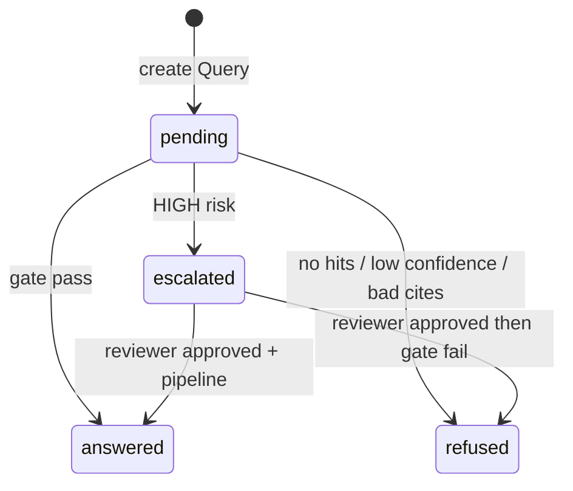

**Query.status:** `pending` → `answered` | `refused` | `escalated`  

**Review item.status:** `pending` → `approved` | `rejected` | `overridden`  

**API query statuses in JSON:** `answered` | `refused` | `escalated`
